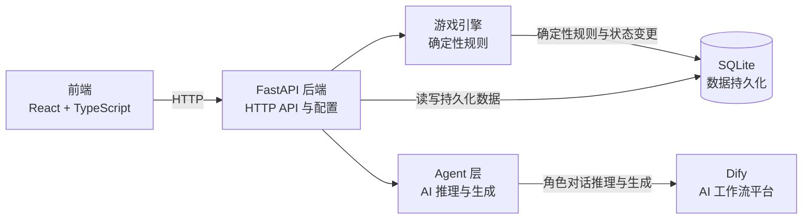
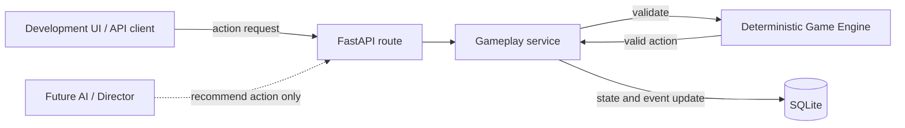
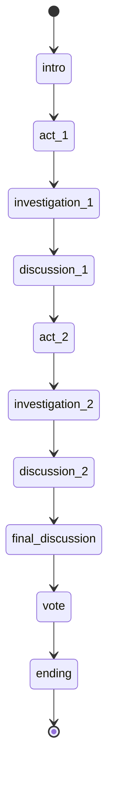
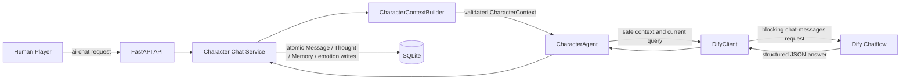
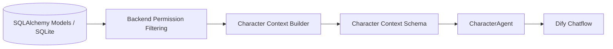

# 架构说明

## 当前系统边界

Phase 3 建立了固定剧情阶段、确定性游戏开始/推进、角色搜证与 public/private 消息 API。Phase 4 增加真人到单个 AI 角色的私聊闭环。Phase 5 为这条链路增加结构化角色状态与最小长期记忆；不改变 Game Engine 的确定性规则和权威信息边界。

## 职责边界

- **Frontend** 展示 Web 界面并调用后端 API，不持有游戏规则或持久化状态。
- **FastAPI Backend** 提供 HTTP 接口，连接前端与服务端各层。
- **Game Engine** 负责确定性游戏规则，是唯一可以校验并应用核心游戏状态变更的层。
- **Game Engine** 负责校验角色选择状态，并锁定一个 human 与三个 ai 的确定性分配。
- **Agent Layer** 负责 AI 推理与生成。Phase 5 的 Character Agent 返回经 Schema 验证的 speech、inner_os、emotion、intent 和 memory updates；AI 不允许直接修改核心游戏状态。
- **Database** 使用 SQLite 持久化脚本模板与游戏运行数据。SQLAlchemy 模型表达真相；Alembic 负责后续表结构迁移，`create_all` 只创建缺失表。
- **Dify** 由后端 Dify Client 调用，执行 Character Chatflow 并返回生成台词。Dify 不拥有权威游戏状态。

## Deterministic Game Engine

Game Engine owns deterministic game truth. Phase 3 的规则位于 `backend/app/game/state_machine.py`，数据库操作位于 `backend/app/services/gameplay.py`：

流程是：Game Engine 校验动作，Gameplay Service 应用通过校验的权威状态变更，并在同一提交中记录公开 system event。API route 只负责 HTTP 请求/响应映射。未来的 AI 或 Director 只能提出动作建议；后端规则通过校验后才可应用，AI 不直接写入核心游戏状态。

Phase 3 使用固定阶段顺序，不接受客户端提交任意目标阶段。搜证资格由后端依据游戏状态和当前阶段判定；线索从当前 Script 的对应 Act 与地点中稳定选取，并只写入执行搜证的 `GameCharacterClue`。`random_seed` 保留在 GameSession 中，但目前不影响状态推进或线索选择。

## Game Lifecycle vs Narrative Phase

`GameSession.status` 表示整局游戏生命周期：

- `waiting_for_character_selection`：等待真人选择角色。
- `ready`：一个 human 与三个 ai 已分配，可以开始。
- `in_progress`：游戏已开始，剧情阶段正在推进。
- `finished`：进入 `ending` 阶段后游戏结束。

旧值 `completed` 与 `abandoned` 暂时保留用于兼容已有数据；Phase 3 新结束流程使用 `finished`。

`GameSession.current_phase` 表示剧情阶段。开始时设为 `intro`，之后仅按以下顺序推进：

进入 `ending` 的同一次推进会同时把 `status` 设为 `finished` 并记录 `ended_at`。`finished` 游戏不再允许推进或搜证。只有 `investigation_1`（线索 `act_1`）和 `investigation_2`（线索 `act_2`）允许搜证。

阶段开始、阶段推进与游戏结束由后端写入固定文案的 system Message；普通消息 API 只能创建 public/private 消息，system 事件不接受客户端输入。

## Information Boundary

游戏信息按可见范围区分：

| 信息范围 | 当前数据示例 | 预期接收者 |
| --- | --- | --- |
| Public Information | Script 的公开元数据、Character 的 `public_background`、已公开线索、公共消息 | 玩家与所有角色 |
| Private Character Information | Character 的 `private_background`、个人目标、私聊消息及接收对象 | 对应角色或明确获准的接收者 |
| God/Director Information | `is_killer`、完整案件真相及全局裁定事实 | Game Engine 与 Director；普通角色不接收完整内容 |

当前基础 API 的 `GET /api/scripts` 和 `GET /api/scripts/{script_id}` 只返回 Script 元数据；`GET /api/games/{game_id}` 只返回运行状态、角色姓名和控制类型，不返回角色私密背景、凶手标记、角色运行目标或随机种子。数据库模型中存在更完整的数据，不代表这些字段可以默认向浏览器或角色开放。

普通 Character Agent 不应接收到完整 Script 真相。权限隔离由后端过滤并构造 Context 实现，而不是依靠 Prompt 要求模型保密。

本阶段没有定义完整案件真相的数据格式，因此没有额外加入 truth JSON 字段。等剧本真相的稳定结构确定后，再决定是否使用单个 JSON 字段或独立模型。

## AI Integration Boundary

当前单角色私聊链路为：

`CharacterContextBuilder` 是唯一负责角色信息过滤的组件。CharacterAgent 接收经过 Pydantic 验证的 `CharacterContext` 和本轮玩家输入，不持有数据库 Session，不访问 ORM；DifyClient 只负责 HTTP、认证、超时和响应解析，不包含剧本或游戏规则。CharacterAgent 把 Dify Answer 解析为 `CharacterModelOutput` 并严格验证，再转换为内部 `CharacterReply`。Dify 请求使用 `DIFY_API_URL` 与 `DIFY_CHARACTER_API_KEY`，配置状态由 `GET /api/ai/status` 提供；该接口只返回是否已配置，不返回密钥。`POST /api/games/{game_id}/ai-chat` 只支持玩家向同局一个 AI 角色私聊。

对话历史仍以 SQLite 中的 `Message` 为准。每次请求均使用新 Dify conversation（`conversation_id` 为空），不把 Dify conversation 当作游戏记忆或权威对话记录。CharacterContext 只包含该目标角色获准看到的消息、已知线索和该角色自己的长期记忆；当前玩家消息单独作为本轮 query 发送。最近 20 条 public/system 与最近 20 条当前角色相关 private 消息进入 Context；Memory 最多 20 条，按 importance、created_at、ID 降序。历史 Thought 不自动进入 Context。

一轮的事务顺序是：校验游戏与目标角色、构造安全 Context、调用 Dify、验证整个结构化输出，然后在同一数据库事务中写入 Human Message、AI speech Message、CharacterThought、去重后的 CharacterMemory updates，并更新 `GameCharacter.current_emotion`。输出验证失败时不写入任何轮次数据；数据库写入失败时整轮回滚。`current_goal` 保持不变。AI intent 只是行为描述，不会触发 Game Engine 动作；AI 不会修改阶段、凶手身份、Script 真相或正式线索。

Chatflow 的 Structured Output 和 System Instruction 用于生成稳定结构与角色行为；它们不是信息安全措施。信息安全来自 Context Builder 限制实际发送的数据，不能靠提示词要求模型保密。不得把 API Key、完整角色 Context 或角色秘密写入日志。

## Character Cognitive State

每轮角色对话中的四类数据各自有明确边界：

| 数据 | 含义 | 权威性与可见范围 |
| --- | --- | --- |
| `Message` | 玩家发送的内容或角色实际说出口的 `speech` | 游戏对话记录；按 public/private channel 授权读取 |
| `CharacterThought` | 某条 AI Message 对应的 `inner_os`、emotion、intent | 角色当轮私有演绎状态；普通消息、游戏状态与 Context 不返回 |
| `CharacterMemory` | 某个 GameCharacter 在某局保留的主观信息 | 角色自己的长期主观认知；仅自己的后续 Context 可见，不等于真相 |
| Game Truth | 当前阶段、凶手身份、Script 真相、线索规则等权威事实 | 由 Game Engine 与数据库确定；不由 AI 输出直接修改 |

`CharacterMemory` 可以保存错误怀疑，例如“Alice 认为 Bob 可能是凶手”，即使 Bob 实际不是凶手。Game Engine 不得依据 Memory 自动裁定或修改真相。Memory 关联到单个 GameSession 和其中的 GameCharacter，同一个 Script 开启新局不会继承另一局的记忆。

`CharacterThought.ai_message_id` 唯一，并通过复合外键保证 Thought、AI Message、GameCharacter 属于同一局且消息发送者就是该 GameCharacter。chat service 另外确认目标由 AI 控制，并以 private AI Message 保存回复。Memory 也通过复合外键约束所属 GameSession/角色与来源消息同局。

普通 AI Chat 响应仅返回 Human Message 与 AI `speech` Message。开发专用 `GET /api/games/{game_id}/characters/{game_character_id}/thoughts` 聚合显示 AI Character 的 current emotion、最新 Thought 和最多 20 条 Memory，只在 `APP_ENV=development` 开放；Development 页面明确标记 **DEBUG ONLY**。这没有构成正式玩家的 OS Replay 功能。

## Character Context Pipeline

- Context Builder 位于 `backend/app/services/character_context.py`，只接收指定 `game_id` 和 `game_character_id`；CharacterAgent 仅使用这一安全 Context 与当前玩家消息生成结构化角色回复。
- Builder 先确认运行角色属于该局，再构造明确的 Pydantic `CharacterContext`；它不会把 ORM 对象交给 Agent。
- 当前角色可获得自己的私密背景、目标和运行状态；其他角色只含姓名、身份与公开背景。
- 公共消息和 system 消息进入公共事件流；private 消息只在当前角色是发送者或接收者，且双方都属于该局时出现。
- system 消息目前没有公开/私有子类型，因此本阶段约定所有 system 消息均为公开旁白。后续 Director 私有消息必须先扩展信息类型后才能保存，不能混入当前 system 流。
- `known_clues` 仅读取 `GameCharacterClue` 中授予当前角色的线索，并校验线索仍属于该局 Script；同一剧本的其他线索不会自动进入上下文。
- `memories` 仅读取当前 GameCharacter 在当前 GameSession 中的记录，最多 20 条并按 importance、时间、ID 降序；其他角色 Memory 与任何历史 `inner_os` 都不进入 Context。
- `public_messages` 仅含最近 20 条 public/system 消息；`private_messages` 仅含最近 20 条当前角色发送或接收的 private 消息。两类消息都在 SQL 查询中限量，返回 Context 前按时间正序排列。
- 调试路由只在 `APP_ENV=development` 暴露。角色 Context API 不属于普通游戏前端接口；Character Agent 不直接读取 ORM model，也不直接查询数据库。
- `DirectorContext` 只定义未来 Director 可用的结构，不构造、不开放 API。当前没有完整案件真相字段；Context schema 也不虚构完整真相。

`/api/games/{game_id}/me/character` 当前以本局唯一的 `human` GameCharacter 识别玩家。登录认证尚未实现，因此 GameSession ID 不是用户身份凭据。
