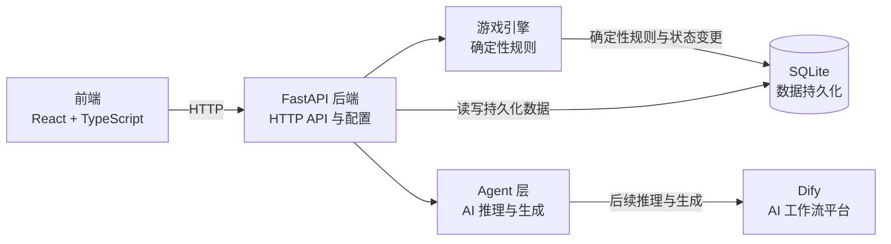

# 架构说明

## 当前系统边界

Phase 1 已建立剧本模板、游戏运行实例、消息与其关系，并提供相应的最小 HTTP API。当前没有游戏状态机、Agent 调用、Dify 请求或实际聊天功能。

## 职责边界

- **Frontend** 展示 Web 界面并调用后端 API，不持有游戏规则或持久化状态。
- **FastAPI Backend** 提供 HTTP 接口，连接前端与服务端各层。
- **Game Engine** 负责确定性游戏规则，是唯一可以校验并应用核心游戏状态变更的层。
- **Agent Layer** 负责 AI 推理与生成。AI 输出交给 Game Engine 处理；AI 不允许直接修改核心游戏状态。
- **Database** 使用 SQLite 持久化脚本模板与游戏运行数据。当前 SQLAlchemy 模型由 FastAPI 启动时创建表；尚未引入 schema migration。
- **Dify** 计划由后端 Agent 层调用。当前只保留 URL 与密钥配置，不调用 Dify。

## Information Boundary

游戏信息按可见范围区分：

| 信息范围 | 当前数据示例 | 预期接收者 |
| --- | --- | --- |
| Public Information | Script 的公开元数据、Character 的 `public_background`、已公开线索、公共消息 | 玩家与所有角色 |
| Private Character Information | Character 的 `private_background`、个人目标、私聊消息及接收对象 | 对应角色或明确获准的接收者 |
| God/Director Information | `is_killer`、完整案件真相及全局裁定事实 | Game Engine 与 Director；普通角色不接收完整内容 |

当前基础 API 的 `GET /api/scripts` 和 `GET /api/scripts/{script_id}` 只返回 Script 元数据；`GET /api/games/{game_id}` 只返回运行状态、角色姓名和控制类型，不返回角色私密背景、凶手标记、角色运行目标或随机种子。数据库模型中存在更完整的数据，不代表这些字段可以默认向浏览器或角色开放。

未来创建 Character Agent 上下文时，后端必须先按接收角色筛选公共信息、该角色私有信息和获准共享信息，再构造输入。权限隔离要由后端上下文构造和确定性规则实现，不能只要求模型通过 Prompt 保密。普通 Character Agent 不应接收到完整 Script 真相。

本阶段没有定义完整案件真相的数据格式，因此没有额外加入 truth JSON 字段。等剧本真相的稳定结构确定后，再决定是否使用单个 JSON 字段或独立模型。
