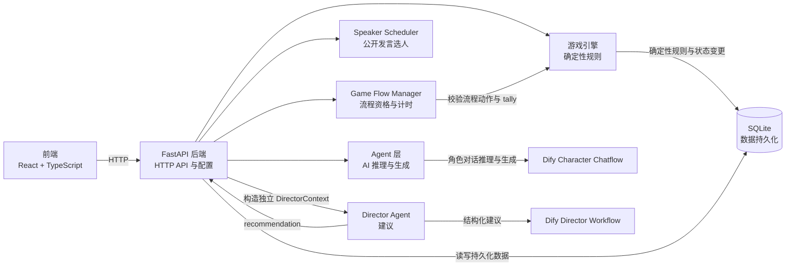
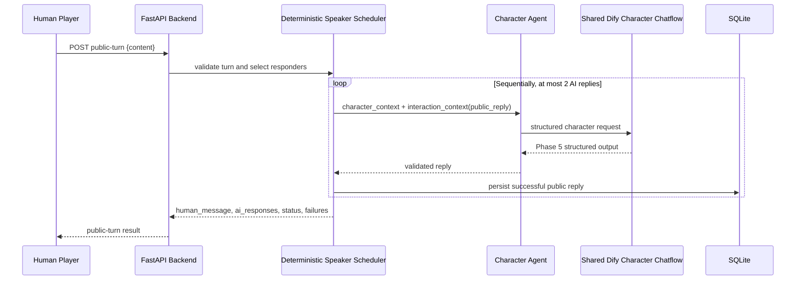
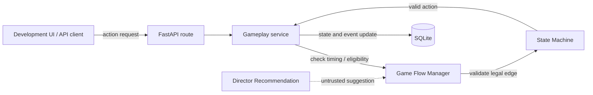
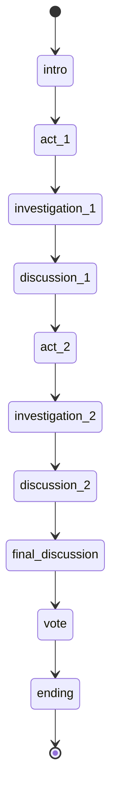
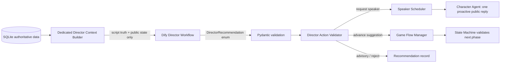
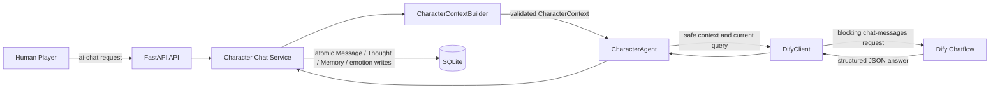
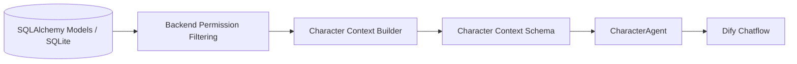

# 架构说明

## 当前系统边界

Phase 3 建立固定阶段转换图、角色搜证与消息 API。Phase 4–5 建立 Character Agent 私聊及结构化状态/记忆。Phase 6 由 Speaker Scheduler 按确定性规则选择公开发言者。Phase 7 增加 Game Flow Manager、阶段计时、确定性投票和独立 Director Workflow；AI 建议仍须经后端规则校验。

## 职责边界

- **Frontend** 展示 Web 界面并调用后端 API，不持有游戏规则或持久化状态。
- **FastAPI Backend** 提供 HTTP 接口，连接前端与服务端各层。
- **Game Engine** 负责确定性游戏规则，是唯一可以校验并应用核心游戏状态变更的层。
- **Game Engine** 负责校验角色选择状态，并锁定一个 human 与三个 ai 的确定性分配。
- **`state_machine.py`** 定义固定的合法 phase transition graph：回答“从当前阶段可以去哪里”。它不负责计时、动作资格或投票。
- **Game Flow Manager** 是确定性流程控制：回答“当前是否允许执行动作”。它计算阶段时间、搜证/讨论/投票/推进资格，协调 State Machine 验证转换，并负责 Vote 校验和确定性 tally。它不调用任何 LLM。
- **Speaker Scheduler** 位于 `backend/app/game/speaker_scheduler.py`，负责对话内的角色发言调度，例如点名匹配、round-robin 与 reaction responder。它与 phase progression、timing 和 vote 是不同领域。
- **Character Agent** 负责单个角色推理与生成，经 Schema 验证返回 speech、inner_os、emotion、intent 和 memory updates；AI 不允许直接修改核心游戏状态。
- **Director Agent** 观察受限的导演视角并生成有限的 `DirectorRecommendation`。它既不是 Game Flow Manager，也不是 Speaker Scheduler；Director 不能写权威状态、改票、推进阶段或直接调用 Character Agent。
- **Database** 使用 SQLite 持久化脚本模板与游戏运行数据。SQLAlchemy 模型表达真相；Alembic 负责后续表结构迁移，`create_all` 只创建缺失表。
- **Dify Character Chatflow** 生成角色台词；**Dify Director Workflow** 生成导演建议。两者使用独立 App Key 和 Context，均不持有权威游戏状态。

## Multi-Agent Orchestration

“多 Agent”在当前阶段表示后端按回合顺序多次调用同一个 Character Agent 实现，不代表多个独立 Dify 工作流。三个 AI 角色共用同一个 Dify Character Chatflow；每次调用都由后端分别构造 `character_context` 和 `interaction_context`。`interaction_context.mode` 只使用 `private_reply`、`public_reply`、`proactive_public`：分别表示私聊回复、公开回合回复、主动公开发言。权限仍由后端构造 Context 时落实，mode 只说明交互用途，不授予额外信息访问权限。

`POST /api/games/{game_id}/public-turn` 接受 `{ "content": "..." }`，响应含 `human_message`、`ai_responses`、`status`（`completed` 或 `partial`）和 `failures`。`partial` 用于 CharacterAgent/Dify 调用、输出校验或角色回复原子保存失败；Context 构造等未捕获服务错误仍可能返回 HTTP 500。`POST /api/games/{game_id}/ai-step` 仅在 `APP_ENV=development` 开放，用 `proactive_public` 模式触发单个 AI 角色，并返回 `ai_message`。主动 step 使用的 synthetic trigger 是后端编排信号，不是玩家发言，不创建 `Message`。公开消息仍由后端作为实际消息写入；Dify 只生成结构化角色回复，不直接写数据库。

Speaker Scheduler 负责确定性 speaker scheduling；Character Agent 负责单个角色推理与生成；Director 观察整体叙事节奏并提出 recommendation。三者职责不同。Phase 7 的 Director 通过独立 Workflow 调用；Writer AI 尚未实现，Director 不生成或修改剧本。

## Multi-Agent Failure Semantics

- 私聊 `POST /api/games/{game_id}/ai-chat` 保持整轮 atomic：Dify 成功并通过输出校验后，玩家消息、AI 消息、Thought、Memory 与 emotion 才一起提交；调用或校验失败不留下半轮数据。
- 公开回合先提交 Human Message，再顺序请求角色；每条 AI Message、Thought、Memory 与 emotion 独立原子保存。CharacterAgent/Dify 调用或单条角色回复保存失败时，后端保留此前已提交的消息并以 `partial` 和脱敏 `failures` 报告。Context 构造等未捕获错误可能返回 HTTP 500，但不会撤销此前已提交的消息。`completed` 表示本次请求的步骤均成功完成。
- 主动 step 每次仅请求一个角色。合成触发内容用于说明为何需要主动发言，不会伪装成玩家消息或存为 `Message`。
- 所有角色调用继续使用 Phase 5 的 Structured Output；无效输出不会被持久化为 AI Message。Speaker Scheduler 只协调角色调用顺序，不把 LLM 结果当成权威游戏状态。

## Deterministic Game Engine

Game Engine owns deterministic game truth. 合法阶段转换图位于 `backend/app/game/state_machine.py`；Game Flow Manager 在此图之上计算当前动作资格；数据库操作由 gameplay service 持久化：

流程是：Game Flow Manager 校验该动作在当前流程中是否合格；State Machine 校验转换是否为唯一合法的下一阶段；Gameplay Service 应用通过校验的权威状态变更，并记录公开 system event。API route 只负责 HTTP 请求/响应映射。Director 只能提出建议；后端 deterministic rules 通过校验后才可应用，AI 不直接写入核心游戏状态。

Phase 3 使用固定阶段顺序，不接受客户端提交任意目标阶段。搜证资格由后端依据游戏状态和当前阶段判定；线索从当前 Script 的对应 Act 与地点中稳定选取，并只写入执行搜证的 `GameCharacterClue`。`random_seed` 保留在 GameSession 中，但目前不影响状态推进或线索选择。

## Game Flow Manager 与阶段计时

`GameSession.current_phase` 表示流程节点；`phase_started_at` 表示当前节点开始的服务端时间。整局的 `started_at` 仍只表示游戏启动时刻，两者不可互换。Game Flow Manager 使用集中式 V0.1 timing policy 读取当前阶段的 `minimum_duration_seconds`，根据服务端时间计算经过和剩余秒数。当前开发默认值是除 `ending` 外每阶段 10 秒、`ending` 为 0 秒；规则集中在 `backend/app/game/flow_manager.py`，后续可调整，并不代表最终产品节奏。测试注入当前时间，不需真实等待。此版本不运行后台计时器，页面倒计时只是显示，服务端始终重新计算资格。

State Machine 只回答“这个 phase 是否有下一条合法边”；Flow Manager 同时校验游戏 lifecycle、最短阶段时间、调查/讨论/投票资格和投票完成条件。正式推进顺序为：API 请求 → Flow Manager validation → State Machine transition validation → 保存下一 phase、`phase_started_at` 与事件。Development Manual Advance 仍是单步请求，不能传任意目标 phase。

`GET /api/games/{game_id}/flow` 返回安全 `GameFlowState`，包括生命周期、phase、`phase_started_at`、elapsed、minimum/remaining 时间、`minimum_time_satisfied`、`can_investigate`、`can_discuss`、`can_vote`、`can_advance` 与 `is_finished`。它不返回 culprit 或角色私密资料。投票阶段的玩家安全进度不包含尚未结束的完整票型。

## Deterministic Voting

Vote 是一局中的正式记录。Game Flow Manager 要求游戏为 `in_progress` 且处于 `vote` phase；voter 和 target 都必须属于该局，不能投自己，每名 voter 只能提交一票。V0.1 提交后不能改票；Director 和 Character Agent 没有 Vote 写权限，也不会代替 AI 角色自动投票。

Tally 对同一局所有有效票按 target 计数。最高票唯一时返回该 `winner_game_character_id`；并列最高票时 `is_tie=true` 且 winner 为 `null`。`votes_cast`、`total_voters` 和 `voting_complete` 均由持久化投票记录确定，所有四名角色都投票时才算完成。Director 可在其 context 中看到客观投票进度，但不能增删改 Vote、改变 tally 或挑选平票赢家。完整 tally 仅供 Development 调试。

## Game Lifecycle vs Narrative Phase

`GameSession.status` 表示整局游戏生命周期：

- `waiting_for_character_selection`：等待真人选择角色。
- `ready`：一个 human 与三个 ai 已分配，可以开始。
- `in_progress`：游戏已开始，剧情阶段正在推进。
- `finished`：进入 `ending` 阶段后游戏结束。

旧值 `completed` 与 `abandoned` 暂时保留用于兼容已有数据；Phase 3 新结束流程使用 `finished`。

`GameSession.current_phase` 表示剧情阶段。开始时设为 `intro`，之后仅按以下顺序推进：

进入 `ending` 的同一次推进会同时把 `status` 设为 `finished` 并记录 `ended_at`。`finished` 游戏不再允许推进或搜证。只有 `investigation_1`（线索 `act_1`）和 `investigation_2`（线索 `act_2`）允许搜证。

阶段开始、阶段推进与游戏结束由后端写入固定文案的 system Message；普通消息 API 只能创建 public/private 消息，system 事件不接受客户端输入。

## Information Boundary

游戏信息按可见范围区分：

| 信息范围 | 当前数据示例 | 预期接收者 |
| --- | --- | --- |
| Public Information | Script 的公开元数据、Character 的 `public_background`、已公开线索、公共消息 | 玩家与所有角色 |
| Private Character Information | Character 的 `private_background`、个人目标、私聊消息及接收对象 | 对应角色或明确获准的接收者 |
| God/Director Information | `is_killer`、角色剧本秘密、核心线索及全局裁定事实 | Game Engine 与 Director；普通角色不接收完整内容 |

当前基础 API 的 `GET /api/scripts` 和 `GET /api/scripts/{script_id}` 只返回 Script 元数据；`GET /api/games/{game_id}` 只返回运行状态、角色姓名和控制类型，不返回角色私密背景、凶手标记、角色运行目标或随机种子。数据库模型中存在更完整的数据，不代表这些字段可以默认向浏览器或角色开放。

普通 Character Agent 不应接收到完整 Script 真相。权限隔离由后端过滤并构造 Context 实现，而不是依靠 Prompt 要求模型保密。

本阶段没有定义完整案件真相的数据格式，因此没有额外加入 truth JSON 字段。等剧本真相的稳定结构确定后，再决定是否使用单个 JSON 字段或独立模型。

## Director Information Boundary

Director 使用独立的 `DirectorContext` builder/schema，不复用 `CharacterContext`，也不存在 `god_mode` 参数。它是“知道剧本真相、观察公开局势的导演”，不是能够读取所有角色脑内状态的上帝。

| Director 可以看到 | Director 明确不能看到 |
| --- | --- |
| 当前 Script 元数据、剧本角色定义、`private_background`、个人目标与 `is_killer` | `CharacterThought` / `inner_os` |
| Clue 定义、act、location、核心标志、重要度及客观的角色获得情况 | `CharacterMemory` |
| 当前 GameSession lifecycle、phase、phase timer、可用动作与投票进度 | public/private 以外的所有 private Message，包括 Human ↔ AI 和 AI ↔ AI 私聊 |
| 最近最多 50 条 public/system 消息与公开语音内容 | 角色运行时推理、`current_emotion`、`intent`、Character Agent 原始结构化输出或 Dify prompt 历史 |
| 由后端统计的各角色公开发言次数与最近公开发言时间；最近发言达到 120 秒时标记 inactive | 由某角色私密 Context、Thought 或 Memory 推导的参与度 |

Director 不用角色 Memory 代替事件摘要。只有当前已有的 Script 权威字段进入 Context；当前没有 canonical truth/timeline 字段时，不临时创建万能 JSON，Writer Phase 再设计正式的剧本真相结构。Director Context 不返回给浏览器，日志也不应记录完整 Context。

Director Workflow 输入为 `director_context` JSON string，经 blocking `/workflows/run` 请求；它与 Character Chatflow 使用独立的 Dify API Key 和 workflow app。Dify 成功响应须为 `data.status=succeeded`，最终 JSON 对象位于 `data.outputs.recommendation`；后端也接受该字段为序列化 JSON string，再进行解析。对象只允许预定义 `pace`、`narrative_risk`、`recommended_action`、`reason` 和 action-specific 引用 ID；Pydantic Schema 禁止额外字段，再由 Action Validator 验证引用与权限。禁止使用 `command` 字符串、动态 dispatch 或 `eval`。

`no_action` 是无副作用成功。`request_ai_speaker` 只有在目标是当前局可发言 AI 且 phase 允许公开发言时，才由后端经 Speaker Scheduler 触发一次 `proactive_public`；不链式触发其他 Agent。`recommend_phase_advance` 交给 Flow Manager 与 State Machine 重新校验 lifecycle、phase timing 和 voting requirements。`suggest_clue_hint` 和 `highlight_public_fact` 只验证引用线索/消息属于当前剧本/游戏，再保存为 advisory，不广播线索或改写消息。无效建议标记 rejected，所有状态修改仍由后端确定性服务执行。

Director 是推荐者，不是 command executor。它不能创建或改变 Vote、决定 tally/tie winner、写阶段状态、变更凶手或改写 Script。Speaker Scheduler 管谁接下来发言；Game Flow Manager 管现在流程是否允许动作；这两个后端确定性领域服务不会把决定权交给 Director。

## AI Integration Boundary

当前单角色私聊链路为：

`CharacterContextBuilder` 是唯一负责角色信息过滤的组件。CharacterAgent 接收经过 Pydantic 验证的 `CharacterContext` 和本轮玩家输入，不持有数据库 Session，不访问 ORM；DifyClient 只负责 HTTP、认证、超时和响应解析，不包含剧本或游戏规则。CharacterAgent 把 Dify Answer 解析为 `CharacterModelOutput` 并严格验证，再转换为内部 `CharacterReply`。Dify 请求使用 `DIFY_API_URL` 与 `DIFY_CHARACTER_API_KEY`，配置状态由 `GET /api/ai/status` 提供；该接口只返回是否已配置，不返回密钥。`POST /api/games/{game_id}/ai-chat` 只支持玩家向同局一个 AI 角色私聊。

对话历史仍以 SQLite 中的 `Message` 为准。每次请求均使用新 Dify conversation（`conversation_id` 为空），不把 Dify conversation 当作游戏记忆或权威对话记录。CharacterContext 只包含该目标角色获准看到的消息、已知线索和该角色自己的长期记忆；当前玩家消息单独作为本轮 query 发送。最近 20 条 public/system 与最近 20 条当前角色相关 private 消息进入 Context；Memory 最多 20 条，按 importance、created_at、ID 降序。历史 Thought 不自动进入 Context。

一轮的事务顺序是：校验游戏与目标角色、构造安全 Context、调用 Dify、验证整个结构化输出，然后在同一数据库事务中写入 Human Message、AI speech Message、CharacterThought、去重后的 CharacterMemory updates，并更新 `GameCharacter.current_emotion`。输出验证失败时不写入任何轮次数据；数据库写入失败时整轮回滚。`current_goal` 保持不变。AI intent 只是行为描述，不会触发 Game Engine 动作；AI 不会修改阶段、凶手身份、Script 真相或正式线索。

Chatflow 的 Structured Output 和 System Instruction 用于生成稳定结构与角色行为；它们不是信息安全措施。信息安全来自 Context Builder 限制实际发送的数据，不能靠提示词要求模型保密。不得把 API Key、完整角色 Context 或角色秘密写入日志。

## Character Cognitive State

每轮角色对话中的四类数据各自有明确边界：

| 数据 | 含义 | 权威性与可见范围 |
| --- | --- | --- |
| `Message` | 玩家发送的内容或角色实际说出口的 `speech` | 游戏对话记录；按 public/private channel 授权读取 |
| `CharacterThought` | 某条 AI Message 对应的 `inner_os`、emotion、intent | 角色当轮私有演绎状态；普通消息、游戏状态与 Context 不返回 |
| `CharacterMemory` | 某个 GameCharacter 在某局保留的主观信息 | 角色自己的长期主观认知；仅自己的后续 Context 可见，不等于真相 |
| Game Truth | 当前阶段、凶手身份、Script 真相、线索规则等权威事实 | 由 Game Engine 与数据库确定；不由 AI 输出直接修改 |

`CharacterMemory` 可以保存错误怀疑，例如“Alice 认为 Bob 可能是凶手”，即使 Bob 实际不是凶手。Game Engine 不得依据 Memory 自动裁定或修改真相。Memory 关联到单个 GameSession 和其中的 GameCharacter，同一个 Script 开启新局不会继承另一局的记忆。

`CharacterThought.ai_message_id` 唯一，并通过复合外键保证 Thought、AI Message、GameCharacter 属于同一局且消息发送者就是该 GameCharacter。chat service 另外确认目标由 AI 控制，并以 private AI Message 保存回复。Memory 也通过复合外键约束所属 GameSession/角色与来源消息同局。

普通 AI Chat 响应仅返回 Human Message 与 AI `speech` Message。开发专用 `GET /api/games/{game_id}/characters/{game_character_id}/thoughts` 聚合显示 AI Character 的 current emotion、最新 Thought 和最多 20 条 Memory，只在 `APP_ENV=development` 开放；Development 页面明确标记 **DEBUG ONLY**。这没有构成正式玩家的 OS Replay 功能。

## Character Context Pipeline

- Context Builder 位于 `backend/app/services/character_context.py`，只接收指定 `game_id` 和 `game_character_id`；CharacterAgent 仅使用这一安全 Context 与当前玩家消息生成结构化角色回复。
- Builder 先确认运行角色属于该局，再构造明确的 Pydantic `CharacterContext`；它不会把 ORM 对象交给 Agent。
- 当前角色可获得自己的私密背景、目标和运行状态；其他角色只含姓名、身份与公开背景。
- 公共消息和 system 消息进入公共事件流；private 消息只在当前角色是发送者或接收者，且双方都属于该局时出现。
- system 消息目前没有公开/私有子类型，因此本阶段约定所有 system 消息均为公开旁白。后续 Director 私有消息必须先扩展信息类型后才能保存，不能混入当前 system 流。
- `known_clues` 仅读取 `GameCharacterClue` 中授予当前角色的线索，并校验线索仍属于该局 Script；同一剧本的其他线索不会自动进入上下文。
- `memories` 仅读取当前 GameCharacter 在当前 GameSession 中的记录，最多 20 条并按 importance、时间、ID 降序；其他角色 Memory 与任何历史 `inner_os` 都不进入 Context。
- `public_messages` 仅含最近 20 条 public/system 消息；`private_messages` 仅含最近 20 条当前角色发送或接收的 private 消息。两类消息都在 SQL 查询中限量，返回 Context 前按时间正序排列。
- 调试路由只在 `APP_ENV=development` 暴露。角色 Context API 不属于普通游戏前端接口；Character Agent 不直接读取 ORM model，也不直接查询数据库。
- Director 使用与角色 Context 独立的 `DirectorContext` builder/schema；它只读取当前 Script 权威字段与公开/客观游戏状态，不能访问 CharacterThought、CharacterMemory 或 private Message。当前没有完整案件真相字段；Context schema 也不虚构完整真相。

`/api/games/{game_id}/me/character` 当前以本局唯一的 `human` GameCharacter 识别玩家。登录认证尚未实现，因此 GameSession ID 不是用户身份凭据。
