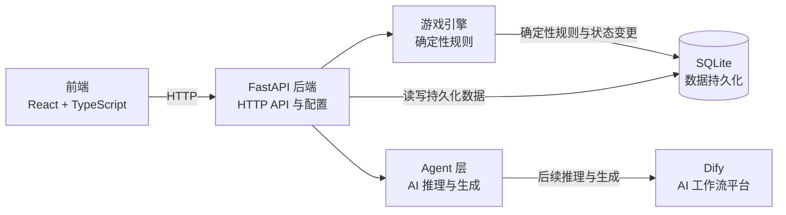
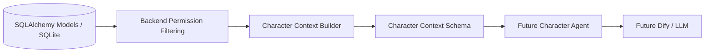

# 架构说明

## 当前系统边界

Phase 2 已建立真人角色选择、运行态已知线索关系和按角色授权构造的 Context。当前没有完整游戏状态机、Agent 调用、Dify 请求或实际聊天功能。

## 职责边界

- **Frontend** 展示 Web 界面并调用后端 API，不持有游戏规则或持久化状态。
- **FastAPI Backend** 提供 HTTP 接口，连接前端与服务端各层。
- **Game Engine** 负责确定性游戏规则，是唯一可以校验并应用核心游戏状态变更的层。
- **Game Engine** 负责校验角色选择状态，并锁定一个 human 与三个 ai 的确定性分配。
- **Agent Layer** 负责 AI 推理与生成。AI 输出交给 Game Engine 处理；AI 不允许直接修改核心游戏状态。
- **Database** 使用 SQLite 持久化脚本模板与游戏运行数据。SQLAlchemy 模型表达真相；Alembic 负责后续表结构迁移，`create_all` 只创建缺失表。
- **Dify** 计划由后端 Agent 层调用。当前只保留 URL 与密钥配置，不调用 Dify。

## Information Boundary

游戏信息按可见范围区分：

| 信息范围 | 当前数据示例 | 预期接收者 |
| --- | --- | --- |
| Public Information | Script 的公开元数据、Character 的 `public_background`、已公开线索、公共消息 | 玩家与所有角色 |
| Private Character Information | Character 的 `private_background`、个人目标、私聊消息及接收对象 | 对应角色或明确获准的接收者 |
| God/Director Information | `is_killer`、完整案件真相及全局裁定事实 | Game Engine 与 Director；普通角色不接收完整内容 |

当前基础 API 的 `GET /api/scripts` 和 `GET /api/scripts/{script_id}` 只返回 Script 元数据；`GET /api/games/{game_id}` 只返回运行状态、角色姓名和控制类型，不返回角色私密背景、凶手标记、角色运行目标或随机种子。数据库模型中存在更完整的数据，不代表这些字段可以默认向浏览器或角色开放。

普通 Character Agent 不应接收到完整 Script 真相。权限隔离由后端过滤并构造 Context 实现，而不是依靠 Prompt 要求模型保密。

本阶段没有定义完整案件真相的数据格式，因此没有额外加入 truth JSON 字段。等剧本真相的稳定结构确定后，再决定是否使用单个 JSON 字段或独立模型。

## Character Context Pipeline

- Context Builder 位于 `backend/app/services/character_context.py`，只接收指定 `game_id` 和 `game_character_id`。
- Builder 先确认运行角色属于该局，再构造明确的 Pydantic `CharacterContext`；它不会把 ORM 对象交给 Agent。
- 当前角色可获得自己的私密背景、目标和运行状态；其他角色只含姓名、身份与公开背景。
- 公共消息和 system 消息进入公共事件流；private 消息只在当前角色是发送者或接收者，且双方都属于该局时出现。
- system 消息目前没有公开/私有子类型，因此本阶段约定所有 system 消息均为公开旁白。后续 Director 私有消息必须先扩展信息类型后才能保存，不能混入当前 system 流。
- `known_clues` 仅读取 `GameCharacterClue` 中授予当前角色的线索，并校验线索仍属于该局 Script；同一剧本的其他线索不会自动进入上下文。
- 调试路由只在 `APP_ENV=development` 暴露。角色 Context API 不属于普通游戏前端接口；Character Agent 不直接读取 ORM model，也不直接查询数据库。
- `DirectorContext` 只定义未来 Director 可用的结构，不构造、不开放 API。当前没有完整案件真相字段；Context schema 也不虚构完整真相。

`/api/games/{game_id}/me/character` 当前以本局唯一的 `human` GameCharacter 识别玩家。登录认证尚未实现，因此 GameSession ID 不是用户身份凭据。
