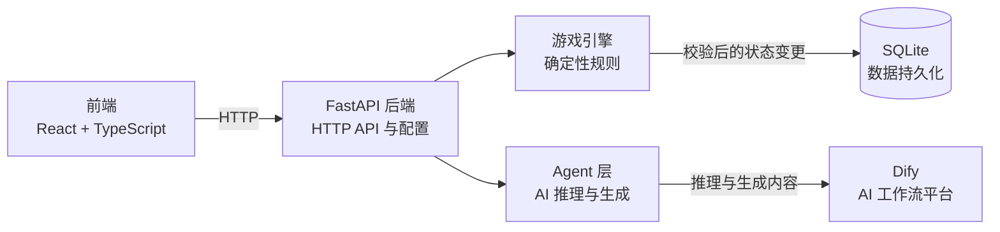

# 架构说明

## 当前系统边界

Phase 0 只实现前端骨架、`GET /api/health`、配置读取，以及 SQLite engine/session 基础。当前没有游戏规则、Agent 调用、Dify 请求或业务表。

## 职责边界

- **Frontend** 展示 Web 界面并调用后端 API，不持有游戏规则或持久化状态。
- **FastAPI Backend** 提供 HTTP 接口，连接前端与服务端各层。
- **Game Engine** 负责确定性游戏规则，是唯一可以校验并应用核心游戏状态变更的层。
- **Agent Layer** 负责 AI 推理与生成。AI 输出交给 Game Engine 处理；AI 不允许直接修改核心游戏状态。
- **Database** 持久化应用数据。Phase 0 只定义 SQLAlchemy `Base`、engine 和 session 管理，不创建业务表。
- **Dify** 通过后端集成提供 AI 工作流。Phase 0 只预留 URL 与密钥配置，不调用 Dify。
