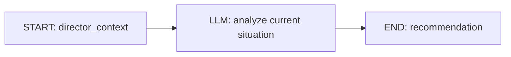

# Dify Director Workflow 配置

本文描述后端 Director Workflow 的输入、输出和安全边界。它是独立的 Dify Workflow App，不复用 Character Chatflow。部署到 Dify 后的配置和真实调用需要在对应环境单独验证；仓库中的自动化测试使用 mock，不代表真实 Dify smoke test 已通过。

## 工作流职责

Workflow 只读取后端提供的 `DirectorContext` 并生成一个结构化建议。它不连接项目数据库、不调用 Character Agent、不执行工具，也不直接修改游戏、投票或剧本数据。后端保存建议后，仍由 Director Action Validator 检查引用和权限；Game Flow Manager 再检查阶段推进条件。只有后端确定性规则可以应用有效状态变更。

推荐的最小工作流：



不要向 Director Workflow 添加 Tool Calling、Agent Node、RAG、数据库连接或 HTTP 工具。

## 后端配置

在本地 `.env` 中设置 Director Workflow API Key。它必须对应单独发布的 Director Workflow App，与 Character Chatflow 的 Key 分开：

```dotenv
DIFY_API_URL=https://api.dify.ai/v1
DIFY_CHARACTER_API_KEY=your-character-app-key
DIFY_DIRECTOR_API_KEY=your-director-workflow-key
```

不要将真实密钥写入源码、前端、文档或 `.env.example`。Director 分析 API 仅用于 `APP_ENV=development` 的手动调试，不会后台自动调用。

## Workflow 输入

后端以 blocking 模式请求 Dify Workflow API：

```http
POST {DIFY_API_URL}/workflows/run
Authorization: Bearer {DIFY_DIRECTOR_API_KEY}
Content-Type: application/json
```

请求的核心字段如下：

```json
{
  "inputs": {
    "director_context": "{\"game_id\":123,\"script\":{...},\"game_flow\":{...},\"voting_state\":{...},\"public_state\":{...},\"clue_progress\":[...],\"participation\":[...]}"
  },
  "response_mode": "blocking",
  "user": "game-123-director"
}
```

在 Dify Workflow 的 Start 节点创建名为 `director_context` 的**文本输入**。其内容是后端序列化后的完整 JSON 字符串，而不是 Dify 自行从数据库查询的对象。Workflow 每次接收最新 Context，不使用对话会话记忆；`user` 是本局 Director 调用标识，不是玩家身份认证。

`DirectorContext` 包含剧本权威资料、凶手标记、角色剧本秘密、线索定义、阶段与计时、客观线索获得状态、最近最多 50 条公开/系统消息、后端统计的发言参与度（最近公开发言达到 120 秒标记 inactive）及投票流程状态。它刻意不包含 `CharacterThought`、`inner_os`、`CharacterMemory`、私聊消息、角色运行时推理、`current_emotion`、`intent` 或 Character Chatflow 的历史输出。不要在 Dify Prompt 中要求后端未提供的私有信息，也不要在 Workflow 中拼接或推断缺失的私人数据。

## Workflow 输出

LLM 节点启用结构化输出，Workflow 的最终输出严格返回一个符合以下契约的 JSON 对象：

```json
{
  "pace": "on_track",
  "narrative_risk": "low",
  "recommended_action": "no_action",
  "reason": "公开讨论仍围绕已出现的线索展开。",
  "target_game_character_id": null,
  "clue_id": null,
  "public_message_id": null
}
```

字段约束：

| 字段 | 允许值 / 类型 | 条件 |
| --- | --- | --- |
| `pace` | `on_track`、`stalled`、`rushed`、`off_track` | 必填枚举 |
| `narrative_risk` | `low`、`medium`、`high` | 必填枚举 |
| `recommended_action` | `no_action`、`request_ai_speaker`、`recommend_phase_advance`、`suggest_clue_hint`、`highlight_public_fact` | 必填枚举 |
| `reason` | 字符串 | 必填，说明建议依据 |
| `target_game_character_id` | 正整数或 `null` | `request_ai_speaker` 时必须引用目标角色 |
| `clue_id` | 正整数或 `null` | `suggest_clue_hint` 时必须引用现有线索 |
| `public_message_id` | 正整数或 `null` | `highlight_public_fact` 时必须引用现有公开消息 |

输出仅允许上述字段；无关字段、自由 command 字符串、Markdown 围栏、非 JSON 文本或枚举外的值都不符合契约。未使用的可选引用显式返回 `null`。LLM 的结构化结果映射到 Dify Workflow 的 `recommendation` 输出字段。blocking 成功响应要求 `data.status` 为 `succeeded`，且 `data.outputs.recommendation` 为 JSON object；后端也兼容这个字段是 JSON string 的情况。后端 Pydantic Schema 拒绝额外属性，并验证被引用对象确实属于当前游戏；Dify 的结构化输出设置不构成后端授权。

## 推荐系统指令

可将以下原则改写为 Workflow 的 System Instruction：

> 你是剧本杀幕后导演。依据提供的 DirectorContext 观察剧本事实、公开局势与流程状态，并只生成一个 DirectorRecommendation。你可以知道剧本真相和角色剧本秘密，但不能看到或索要角色的私聊、inner_os、Thought、Memory 或运行时私有认知。角色公开说出的谎言不会改变剧本真相。不得创造不存在的事实或线索，不得改凶手、修改历史、决定投票结果、推进阶段或直接调用角色 Agent。`request_ai_speaker`、`recommend_phase_advance` 和其他建议都只是建议；后端会独立校验。对 `suggest_clue_hint` 与 `highlight_public_fact` 只能引用输入中已有的 ID，不能编造引用。严格返回契约要求的 JSON 对象。

Director 的判断只能影响建议内容。具体地，`request_ai_speaker` 需要后端确认目标是本局 AI 角色且 `can_public_speak` 为真；允许公开发言的阶段为 `intro`、`act_1`、`investigation_1`、`discussion_1`、`act_2`、`investigation_2`、`discussion_2` 和 `final_discussion`。`recommend_phase_advance` 需要 Game Flow Manager 确认状态、阶段转换、最短阶段时间和投票条件。`suggest_clue_hint` 与 `highlight_public_fact` 在当前版本保持 advisory，不自动向玩家广播，也不改写公开记录。Director 永远不能直接增删或改票，投票结果由后端确定性 tally 得出。

后端以条件更新将 recommendation 从 `pending` 原子认领为 `applying`，再执行动作并记录最终状态。同一 recommendation 并发或重复 apply 返回 HTTP `409`，不会重复生成公开发言或推进阶段。进程若在动作完成前异常终止，记录会留在 `applying`；再次请求会返回冲突，确认实际状态前不要手动改回 `pending`。

## 本地开发与验证

从 `dify-project/` 根目录完成数据库升级并启动后端：

```bash
alembic -c backend/alembic.ini upgrade head
env -u ALL_PROXY -u all_proxy uvicorn app.main:app --app-dir backend --reload
```

Development 页面中的 Director Debug 使用 **Analyze Situation** 手动请求分析，再显示 recommendation；**Apply Recommendation** 通过后端 validator 申请应用或拒绝。分析接口不会返回完整 `DirectorContext` 给页面，也没有定时任务或自动分析循环。

Development only 的 `GET /api/director/status` 只返回 Director Workflow 的 `configured` 布尔值，不返回密钥。若没有设置 `DIFY_DIRECTOR_API_KEY`，后端仍可运行，但分析请求无法调用 Dify。

也可以用 API 调试。先从开发页面或 `GET /api/games/{game_id}/flow` 确认一局游戏 ID，再调用：

```bash
curl -X POST http://127.0.0.1:8000/api/games/123/director/analyze
curl -X POST http://127.0.0.1:8000/api/games/123/director/recommendations/456/apply
```

将 `123` 和 `456` 替换为本地游戏 ID 与分析响应中的 recommendation ID。对应接口仅在 Development 环境开放；分析需要已配置并发布的 Director Workflow。`GET /api/games/{game_id}/votes/result` 在开发调试中用于查看确定性计票结果。

自动测试通过 mock Workflow Client，不访问真实 Dify。运行后端完整测试、Ruff、Alembic 检查和前端验证的命令见项目 [README](../README.md#测试与构建)。真实 smoke test 必须在已配置的 Dify Director Workflow 上单独执行；只有实际请求成功且返回结构通过后端校验，才能报告该环境的真实调用已验证。
